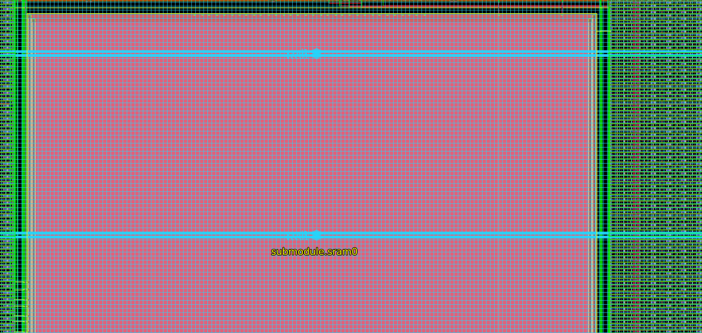

# Mini-Project-in-VLSI-Design-EC383-
Repository for the RTL to GDSII flow run on Openlane for Mini Project in VLSI Design

## Directory Structure
designs/   
├── ci/  
├── designs/  
│   ├── picorv32_base  
│&#8194;&#8194;&#8194;&#8194;├── runs  
│&#8194;&#8194;&#8194;&#8194;├── src  
│&#8194;&#8194;&#8194;&#8194;&#8194;&#8194;├── picorv32_base.v  
│&#8194;&#8194;&#8194;&#8194;├── config.json  
│   └── test_sram_macro  
│&#8194;&#8194;&#8194;&#8194;├── runs  
│&#8194;&#8194;&#8194;&#8194;├── src  
│&#8194;&#8194;&#8194;&#8194;&#8194;&#8194;├── picorv32_base.v  
│&#8194;&#8194;&#8194;&#8194;├── config.json  
├── spm/  
│   ├── runs  
│   └── src  
│   └── verify  
│   └── config.json  
│   └── pin_oder.cfg  
flow.tcl  
images  
README.md

## Specifications of SRAM
+ Two ports in SRAM, `Port 0` for read and write and `Port 1` for read.
+ 1kbyte_1rw1r_32x256_8
+ 32 bit data width and 8 bit address width
+ Positive clock edge address read and negative clock edge data read and write
+ Active low chip select lines `csb0` and `csb1`
+ Active low write control lines `wb0` and `wb1`
+ Write mask `wmask0` for writing 8 bits for a mask bit

## Specifications of Picorv32
+ 250 Mhz
+ Small (750-2000 LUTs in 7-Series Xilinx Architecture)
+ Selectable native memory interface or AXI4-Lite master
+ Optional IRQ support
+ Optional Co-Processor Interface

## Parameters in Picorv32

### COMPRESSED_ISA
This enables support for the RISC-V Compressed Instruction Set. By default it is 0.

### ENABLE_PCPI
Set this to 1 to enable the Pico Co-Processor Interface (PCPI). By default it is 0.

### ENABLE_MUL
This parameter internally enables PCPI and instantiates the picorv32_pcpi_mul core that implements the MUL[H[SU|U]] instructions. The external PCPI interface only becomes functional when ENABLE_PCPI is set as well. By default it is 0.

### ENABLE_FAST_MUL
This parameter internally enables PCPI and instantiates the picorv32_pcpi_fast_mul core that implements the MUL[H[SU|U]] instructions. The external PCPI interface only becomes functional when ENABLE_PCPI is set as well. By default it is 0.

### ENABLE_DIV
This parameter internally enables PCPI and instantiates the picorv32_pcpi_div core that implements the DIV[U]/REM[U] instructions. The external PCPI interface only becomes functional when ENABLE_PCPI is set as well.

### TWO_CYCLE_COMPARE
This relaxes the longest data path a bit by adding an additional FF stage at the cost of adding an additional clock cycle delay to the conditional branch instructions. By default it is 0. Note: Enabling this parameter will be most effective when retiming (aka "register balancing") is enabled in the synthesis flow.

### TWO_CYCLE_ALU
This adds an additional FF stage in the ALU data path, improving timing at the cost of an additional clock cycle for all instructions that use the ALU. By default it is 0.

### Pico Co-Processor Interface (PCPI)
The thing that makes PicoRV32 ideal for use in microcontrollers is its Pico Co-Processor Interface (PCPI) feature. The PCPI is an interface that can be enabled by changing verilog parameters as mentioned above. PCPI helps adding additional functionality to the core easier provided they are non-branching instructions.

### PCPI

When an unsupported instruction is found by PicoRV32 occurs it asserts pcpi_valid. The unsopported instruction is sent to pcpi_insn for the co-processor to recognise it. The decoded values of registers is made available through pcpi_rs1 and pcpi_rs2 and its output can be sent to pcpi_rd. The pcpi_ready needs to asserted when the execution of the instruction is over.

When no external PCPI core acknowledges the instruction within 16 clock cycles, then an illegal instruction exception is raised and the respective interrupt handler is called. A PCPI core that needs more than a couple of cycles to execute an instruction, should assert pcpi_wait as soon as the instruction has been decoded successfully and keep it asserted until it asserts pcpi_ready. This will prevent the PicoRV32 core from raising an illegal instruction exception.

## Flow configuration Variables for SRAM

### Power domain
    "FP_PDN_MULTILAYER": true,
    "EXTRA_LEFS": "/path",
    "EXTRA_GDS_FILES": "/path",
    "EXTRA_LIBS": "/path",
    "VDD_NETS": "vccd1",
    "GND_NETS": "vssd1",
    "FP_PDN_MACRO_HOOKS": "submodule.sram0 vccd1 vssd1 vccd1 vssd1, submodule.sram1 vccd1 vssd1 vccd1 vssd1"
+ Using only lower vertical layer for power distribution network.  
`"FP_PDN_MULTILAYER"`: true  
+ Using only 1 power domain  
`"VDD_NETS"`: "vccd1"  
`"GND_NETS"`: "vssd1"
+ Specifying explicit power connections for the SRAM modules  
`"FP_PDN_MACRO_HOOKS"`: "submodule.sram0 vccd1 vssd1 vccd1 vssd1, submodule.sram1 vccd1 vssd1 vccd1 vssd1"
### Floorplanning and placement
    "FP_SIZING": "absolute",
    "DIE_AREA": "0 0 750 1250",
    "PL_TARGET_DENSITY": 0.5
+ Using absolute sizing  
`"FP_SIZING"`: "absolute"  
+ Die Area  
`"DIE_AREA"`: "0 0 750 1250"
+ Default target density  
`"PL_TARGET_DENSITY"`: 0.5
### Magic and DRC
    "RUN_KLAYOUT_XOR": false,
    "MAGIC_DRC_USE_GDS": false,
    "QUIT_ON_MAGIC_DRC": false,
    "MACRO_PLACEMENT_CFG": "dir::macro_placement.cfg"
+ Checks will be done on the DEF/LEF  
`"MAGIC_DRC_USE_GDS"`: false
+ Checks for DRC violations after magic DRC is executed and exits the flow if any was found
`"QUIT_ON_MAGIC_DRC"`: false
+ Macro placement  
`MACRO_PLACEMENT_CFG` specifies a file (often called macro.cfg or macro_placement.cfg) listing macros to be placed as submodules within the layout being hardened

## Flow configuration Variables for Picorv32

### Clock domain
    "CLOCK_PORT": "clk",
    "CLOCK_PERIOD": 20.0,
    "CTS_SINK_CLUSTERING_SIZE": 60,
    "CTS_SINK_CLUSTERING_MAX_DIAMETER": 60,
    "PL_RESIZER_HOLD_MAX_BUFFER_PERCENT": 99,
    "PL_RESIZER_SETUP_MAX_BUFFER_PERCENT": 99,
    "GLB_RESIZER_HOLD_MAX_BUFFER_PERCENT": 99

+ Clock port used for STA  
`"CLOCK_PORT"`: "clk"
+ Clock period  
`"CLOCK_PERIOD"`: 20.00
+ Specifies the maximum number of sinks per cluster.  
`"CTS_SINK_CLUSTERING_SIZE"`: 60
+ Specifies maximum diameter (in micron) of sink cluster `"CTS_SINK_CLUSTERING_MAX_DIAMETER"`: 60
+ Specifies a max number of buffers to insert to fix hold violations. This number is calculated as a percentage of the number of instances in the design.
`"PL_RESIZER_HOLD_MAX_BUFFER_PERCENT"`: 99
+ Specifies a max number of buffers to insert to fix setup violations. This number is calculated as a percentage of the number of instances in the design.
`"PL_RESIZER_SETUP_MAX_BUFFER_PERCENT"`: 99
+ Specifies a max number of buffers to insert to fix hold violations. This number is calculated as a percentage of the number of instances in the design.
`"GLB_RESIZER_HOLD_MAX_BUFFER_PERCENT"`: 99
### Power domain
    "FP_PDN_MULTILAYER": true
+ Using only lower vertical layer for power distribution network.  
`"FP_PDN_MULTILAYER"`: true
### Floorplanning and placement
    "DIE_AREA": "0 0 3000 3000",
    "FP_CORE_UTIL": 45,
    "PL_TARGET_DENSITY": 0.47
+ Die Area  
`"DIE_AREA"`: "0 0 3000 3000"
+ Core Utilisation
`"FP_CORE_UTIL"`: 45
+ Placement target density  
`"PL_TARGET_DENSITY"`: 0.47

### Routing
    "ROUTING_CORES": 8
+ Specifies the number of threads to be used in TritonRoute.  
`"ROUTING_CORES"`: 8

# Results

+ ## GDS II file of SRAM Macro
  
The submodule SRAM is mainly consisting of metal 2

+ ## VSSD1
  
Uses metal 4 mainly to route clock nets which is in red colour

+ ## VCCD1, VSSD1 and Power nets
  
The box shown contains VCCD1 and VDD1

+ ## Clock net
  
Uses metal 3 to route clock nets which is in green colour

+ ## Data in of SRAM
  
data_in pins

+ ## Data out of SRAM
  
data_out pins

+ ## Address Bus of SRAM
  
address pins

+ ## Tracks
  
Blue lines shown are tracks

+ ## GDS II of Picorv32

+ ## I/O of Picorv32

