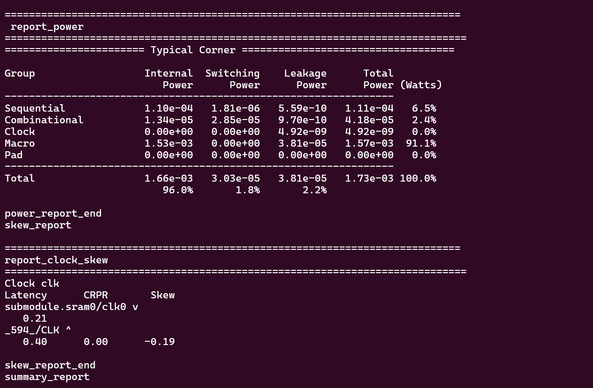

# Mini-Project-in-VLSI-Design-EC383-

Repository for the RTL to GDSII flow run on Openlane for Mini Project in VLSI Design

## Directory Structure
designs/   
├── ci/  
├── designs/  
│   ├── picorv32_base  
│&#8194;&#8194;&#8194;&#8194;├── runs  
│&#8194;&#8194;&#8194;&#8194;├── src  
│&#8194;&#8194;&#8194;&#8194;&#8194;&#8194;├── picorv32_base.v  
│&#8194;&#8194;&#8194;&#8194;├── config.json  
│   └── test_sram_macro  
│&#8194;&#8194;&#8194;&#8194;├── runs  
│&#8194;&#8194;&#8194;&#8194;├── src  
│&#8194;&#8194;&#8194;&#8194;&#8194;&#8194;├── picorv32_base.v  
│&#8194;&#8194;&#8194;&#8194;├── config.json  
├── spm/  
│   ├── runs  
│   └── src  
│   └── verify  
│   └── config.json  
│   └── pin_oder.cfg  
flow.tcl  
images  
README.md

## Specifications of SRAM
+ Two ports in SRAM, `Port 0` for read and write and `Port 1` for read.
+ 1kbyte_1rw1r_32x256_8
+ 32 bit data width and 8 bit address width
+ Positive clock edge address read and negative clock edge data read and write
+ Active low chip select lines `csb0` and `csb1`
+ Active low write control lines `wb0` and `wb1`
+ Write mask `wmask0` for writing 8 bits for a mask bit

## I/O Ports of SRAM

### SRAM submodule 1
    clk0(clk),
    csb0(!cs),
    web0(!we),
    wmask0(write_allow[3:0]),
    addr0(addr),
    din0(datain[31:0]),
    dout0(dataout_int[31:0])
    clk1(1'b0),
    csb1(1'b1),
    addr1(1'b0),
    dout1(dout1[31:0])

### SRAM submodule 2
    clk0(clk),
    csb0(!cs),
    web0(!we),
    wmask0(write_allow[7:4]),
    addr0(addr),
    din0(datain[63:32]),
    dout0(dataout_int[63:32]),
    clk1(1'b0),
    csb1(1'b1),
    addr1(1'b0),
    dout1(dout1[63:32])

### SRAM
    input rst_n,
    input clk,
    input cs,
    input we,
    input [7:0] addr,
    input [7:0] write_allow,
    input [63:0] datain,
    output [63:0] dataout

## Specifications of Picorv32
+ 250 Mhz
+ Small (750-2000 LUTs in 7-Series Xilinx Architecture)
+ Selectable native memory interface or AXI4-Lite master
+ Optional IRQ support
+ Optional Co-Processor Interface

## I/O Ports of Picorv32
	input clk, resetn,
	output reg trap,

	output reg        mem_valid,
	output reg        mem_instr,
	input             mem_ready,

	output reg [31:0] mem_addr,
	output reg [31:0] mem_wdata,
	output reg [ 3:0] mem_wstrb,
	input      [31:0] mem_rdata,

	// Look-Ahead Interface
	output            mem_la_read,
	output            mem_la_write,
	output     [31:0] mem_la_addr,
	output reg [31:0] mem_la_wdata,
	output reg [ 3:0] mem_la_wstrb,

	// Pico Co-Processor Interface (PCPI)
	output reg        pcpi_valid,
	output reg [31:0] pcpi_insn,
	output     [31:0] pcpi_rs1,
	output     [31:0] pcpi_rs2,
	input             pcpi_wr,
	input      [31:0] pcpi_rd,
	input             pcpi_wait,
	input             pcpi_ready,

	// IRQ Interface
	input      [31:0] irq,
	output reg [31:0] eoi,
    `ifdef RISCV_FORMAL
        output reg        rvfi_valid,
        output reg [63:0] rvfi_order,
        output reg [31:0] rvfi_insn,
        output reg        rvfi_trap,
        output reg        rvfi_halt,
        output reg        rvfi_intr,
        output reg [ 1:0] rvfi_mode,
        output reg [ 1:0] rvfi_ixl,
        output reg [ 4:0] rvfi_rs1_addr,
        output reg [ 4:0] rvfi_rs2_addr,
        output reg [31:0] rvfi_rs1_rdata,
        output reg [31:0] rvfi_rs2_rdata,
        output reg [ 4:0] rvfi_rd_addr,
        output reg [31:0] rvfi_rd_wdata,
        output reg [31:0] rvfi_pc_rdata,
        output reg [31:0] rvfi_pc_wdata,
        output reg [31:0] rvfi_mem_addr,
        output reg [ 3:0] rvfi_mem_rmask,
        output reg [ 3:0] rvfi_mem_wmask,
        output reg [31:0] rvfi_mem_rdata,
        output reg [31:0] rvfi_mem_wdata,

        output reg [63:0] rvfi_csr_mcycle_rmask,
        output reg [63:0] rvfi_csr_mcycle_wmask,
        output reg [63:0] rvfi_csr_mcycle_rdata,
        output reg [63:0] rvfi_csr_mcycle_wdata,

        output reg [63:0] rvfi_csr_minstret_rmask,
        output reg [63:0] rvfi_csr_minstret_wmask,
        output reg [63:0] rvfi_csr_minstret_rdata,
        output reg [63:0] rvfi_csr_minstret_wdata,
    `endif

	// Trace Interface
	output reg        trace_valid,
	output reg [35:0] trace_data

## Parameters in Picorv32

### COMPRESSED_ISA
This enables support for the RISC-V Compressed Instruction Set. By default it is 0.

### ENABLE_PCPI
Set this to 1 to enable the Pico Co-Processor Interface (PCPI). By default it is 0.

### ENABLE_MUL
This parameter internally enables PCPI and instantiates the picorv32_pcpi_mul core that implements the MUL[H[SU|U]] instructions. The external PCPI interface only becomes functional when ENABLE_PCPI is set as well. By default it is 0.

### ENABLE_FAST_MUL
This parameter internally enables PCPI and instantiates the picorv32_pcpi_fast_mul core that implements the MUL[H[SU|U]] instructions. The external PCPI interface only becomes functional when ENABLE_PCPI is set as well. By default it is 0.

### ENABLE_DIV
This parameter internally enables PCPI and instantiates the picorv32_pcpi_div core that implements the DIV[U]/REM[U] instructions. The external PCPI interface only becomes functional when ENABLE_PCPI is set as well.

### TWO_CYCLE_COMPARE
This relaxes the longest data path a bit by adding an additional FF stage at the cost of adding an additional clock cycle delay to the conditional branch instructions. By default it is 0. Note: Enabling this parameter will be most effective when retiming (aka "register balancing") is enabled in the synthesis flow.

### TWO_CYCLE_ALU
This adds an additional FF stage in the ALU data path, improving timing at the cost of an additional clock cycle for all instructions that use the ALU. By default it is 0.

### Pico Co-Processor Interface (PCPI)
The thing that makes PicoRV32 ideal for use in microcontrollers is its Pico Co-Processor Interface (PCPI) feature. The PCPI is an interface that can be enabled by changing verilog parameters as mentioned above. PCPI helps adding additional functionality to the core easier provided they are non-branching instructions.

### PCPI

When an unsupported instruction is found by PicoRV32 occurs it asserts pcpi_valid. The unsopported instruction is sent to pcpi_insn for the co-processor to recognise it. The decoded values of registers is made available through pcpi_rs1 and pcpi_rs2 and its output can be sent to pcpi_rd. The pcpi_ready needs to asserted when the execution of the instruction is over.

When no external PCPI core acknowledges the instruction within 16 clock cycles, then an illegal instruction exception is raised and the respective interrupt handler is called. A PCPI core that needs more than a couple of cycles to execute an instruction, should assert pcpi_wait as soon as the instruction has been decoded successfully and keep it asserted until it asserts pcpi_ready. This will prevent the PicoRV32 core from raising an illegal instruction exception.

# Flow configuration

## Flow configuration Variables for SRAM

### Power domain
    "FP_PDN_MULTILAYER": true,
    "EXTRA_LEFS": "/path",
    "EXTRA_GDS_FILES": "/path",
    "EXTRA_LIBS": "/path",
    "VDD_NETS": "vccd1",
    "GND_NETS": "vssd1",
    "FP_PDN_MACRO_HOOKS": "submodule.sram0 vccd1 vssd1 vccd1 vssd1, submodule.sram1 vccd1 vssd1 vccd1 vssd1"
+ Using only lower vertical layer for power distribution network.  
`"FP_PDN_MULTILAYER"`: true  
+ Using only 1 power domain  
`"VDD_NETS"`: "vccd1"  
`"GND_NETS"`: "vssd1"
+ Specifying explicit power connections for the SRAM modules  
`"FP_PDN_MACRO_HOOKS"`: "submodule.sram0 vccd1 vssd1 vccd1 vssd1, submodule.sram1 vccd1 vssd1 vccd1 vssd1"
### Floorplanning and placement
    "FP_SIZING": "absolute",
    "DIE_AREA": "0 0 750 1250",
    "PL_TARGET_DENSITY": 0.5
+ Using absolute sizing  
`"FP_SIZING"`: "absolute"  
+ Die Area  
`"DIE_AREA"`: "0 0 750 1250"
+ Default target density  
`"PL_TARGET_DENSITY"`: 0.5
### Magic and DRC
    "RUN_KLAYOUT_XOR": false,
    "MAGIC_DRC_USE_GDS": false,
    "QUIT_ON_MAGIC_DRC": false,
    "MACRO_PLACEMENT_CFG": "dir::macro_placement.cfg"
+ Checks will be done on the DEF/LEF  
`"MAGIC_DRC_USE_GDS"`: false
+ Checks for DRC violations after magic DRC is executed and exits the flow if any was found
`"QUIT_ON_MAGIC_DRC"`: false
+ Macro placement  
`MACRO_PLACEMENT_CFG` specifies a file (often called macro.cfg or macro_placement.cfg) listing macros to be placed as submodules within the layout being hardened

## Flow configuration Variables for Picorv32

### Clock domain
    "CLOCK_PORT": "clk",
    "CLOCK_PERIOD": 20.0,
    "CTS_SINK_CLUSTERING_SIZE": 60,
    "CTS_SINK_CLUSTERING_MAX_DIAMETER": 60,
    "PL_RESIZER_HOLD_MAX_BUFFER_PERCENT": 99,
    "PL_RESIZER_SETUP_MAX_BUFFER_PERCENT": 99,
    "GLB_RESIZER_HOLD_MAX_BUFFER_PERCENT": 99

+ Clock port used for STA  
`"CLOCK_PORT"`: "clk"
+ Clock period  
`"CLOCK_PERIOD"`: 20.00
+ Specifies the maximum number of sinks per cluster.  
`"CTS_SINK_CLUSTERING_SIZE"`: 60
+ Specifies maximum diameter (in micron) of sink cluster `"CTS_SINK_CLUSTERING_MAX_DIAMETER"`: 60
+ Specifies a max number of buffers to insert to fix hold violations. This number is calculated as a percentage of the number of instances in the design.
`"PL_RESIZER_HOLD_MAX_BUFFER_PERCENT"`: 99
+ Specifies a max number of buffers to insert to fix setup violations. This number is calculated as a percentage of the number of instances in the design.
`"PL_RESIZER_SETUP_MAX_BUFFER_PERCENT"`: 99
+ Specifies a max number of buffers to insert to fix hold violations. This number is calculated as a percentage of the number of instances in the design.
`"GLB_RESIZER_HOLD_MAX_BUFFER_PERCENT"`: 99
### Power domain
    "FP_PDN_MULTILAYER": true
+ Using only lower vertical layer for power distribution network.  
`"FP_PDN_MULTILAYER"`: true
### Floorplanning and placement
    "DIE_AREA": "0 0 3000 3000",
    "FP_CORE_UTIL": 45,
    "PL_TARGET_DENSITY": 0.47
+ Die Area  
`"DIE_AREA"`: "0 0 3000 3000"
+ Core Utilisation
`"FP_CORE_UTIL"`: 45
+ Placement target density  
`"PL_TARGET_DENSITY"`: 0.47

### Routing
    "ROUTING_CORES": 8
+ Specifies the number of threads to be used in TritonRoute.  
`"ROUTING_CORES"`: 8

# PDK

+ ## sky130B

    + 130nm technology node
    + `sky130_fd_io` consists of general purpose I/O buffers
    + `sky130_fd_sc_hd` has clock-gating cells to reduce active power during non-sleep modes. Latches and flip-flops have scan chain equivalents to enable scan chain creation.
    + `sky130_sram_macros` contains the lef and gds files for the SRAM
+ ## Power rating
    + Vdd is 1.8V
+ ## MOSFET
    + `sky130_fd_pr__nfet_01v8 NMOS` is the NMOS device used
    + `sky130_fd_pr__nfet_01v8 PMOS` is the NMOS device used

# Results

+ ## GDS II file of SRAM Macro
  

<b>The submodule SRAM is mainly consisting of metal 2</b>

+ ## VSSD1
  

<b>Uses metal 4 mainly to route clock nets which is in red colour</b>

+ ## VCCD1, VSSD1 and Power nets
  

<b>The box shown contains VCCD1 and VDD1</b>

+ ## Clock net
  

<b>Uses metal 3 to route clock nets which is in green colour</b>

+ ## Data in of SRAM
  

<b>data_in pins</b>

+ ## Data out of SRAM
  

<b>data_out pins</b>

+ ## Address Bus of SRAM
  

<b>address pins</b>

+ ## Tracks
  

<b>Blue lines shown are tracks</b>

+ ## GDS II of Picorv32

+ ## Clock, Reset, PCPI and Trace data

+ ## PCPI, IRQ and EOI

+ ## PCPI, Memory Read data and Write data

## Running the flow for SRAM

+ The flow for SRAM was run in interactive mode  
`flow.tcl --interactive`

+ `prep -design <design> [-tag TAG] [-config CONFIG] [-init_design_config] [-overwrite]`

+ `run_synthesis`  

<b>Synthesis</b>

<b>Synthesis STA</b>

<b>Synthesis STA Slack</b>

+ `run_floorplan`  

  
Core area  
  
Die area

I/O ports

+ `run_placement`  

<b>I/O ports</b>

<b>Placement STA</b>

<b>Placement STA Slack</b>

<b>Filler cells and endcaps</b>

+ `run_cts`

+ `run_routing`

<b>Global Routing STA</b>

<b>Global Routing STA Slack</b>

<b>Routing Layers</b>

<b>Power nets</b>

+ `run_magic`
+ `run_magic_spice_export`
+ `run_magic_drc`
+ `run_lvs`
+ `run_antenna_check`

## Running the flow for Picorv32

+ The flow for Picorv32 was run in interactive mode  
`flow.tcl --interactive`

+ `prep -design <design> [-tag TAG] [-config CONFIG] [-init_design_config] [-overwrite]`

+ `run_synthesis`  

<b>Synthesis</b>

<b>Synthesis STA</b>

<b>Synthesis STA Slack</b>

+ `run_floorplan`  

  
Core area  
  
Die area  
  
I/O ports

+ `run_placement`  

<b>Filler cells and endcaps</b>

<b>PDN</b>

+ `run_cts`  

<b>CTS</b>

+ `run_routing`  

<b>Routing</b>

<b>Routing Layers</b>

+ `run_magic`
+ `run_magic_spice_export`
+ `run_magic_drc`
+ `run_lvs`
+ `run_antenna_check`

## Challenges Faced

### Errors
- Routing congestion issues.
- [INFO GRT-0101] Running extra iterations
to remove overflow.
[INFO GRT-0103] Extra Run for hard
benchmark.
- [ERROR PPL-0072] Number of pins (409)
exceed number of valid positions (384).
- [ERROR DPL-0036] Detailed placement
failed.
Error: resizer.tcl, 79 DPL-0036

### Fixes
- Fixes for routing congestion:
    - Reduce placement utilization or increase area if set manually.
- Fix for abnormally high routing time:
    - Increase Area or `fp_core_util`
- Fix for Insufficient pins:
    - Increase placement utilization
- Possible Fixes for hold violations:
    - Increase Capacitance Increase core utilization percentage
    - Decrease number of CTS sinks
    - Decrease drive strength of buffers
    - Increase no. of buffers placed
Note that most of the hold violation fixes
reduce setup slack so there is a ideal balance
between the two.
- Possible Fixes for setup violations:
    - Reduced clock speed
    - Decrease Capacitance
    - Increase number of CTS sinks
    - Increase drive strength of buffers
    - Increase no. of buffers placed